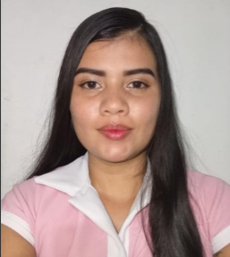

# ✨ **Portafolio Profesional**  
### **Carolina Álvarez**

  

  

 

### 👩‍💻 Desarrolladora de Software en formación  
✨ Creativa • Responsable • En constante aprendizaje ✨

---

## 🚀 Tecnologías que manejo

<!-- Badges -->

---

## 👩‍💻 Sobre mí

Soy una desarrolladora de software en formación, apasionada por crear soluciones funcionales y aprender nuevas tecnologías cada día.  
Me encanta trabajar en proyectos que representen un reto y que me permitan mejorar mis habilidades en programación, diseño y lógica.

Actualmente estoy fortaleciendo mis conocimientos en **HTML, CSS, JavaScript, Java y Git/GitHub**, mientras desarrollo proyectos que combinan creatividad y buenas prácticas.

Mi objetivo es crecer como profesional, construir código de calidad y aportar valor en cada equipo donde participe.

---

# 📘 ¿Qué hay en este portafolio?

✔ Prácticas de programación  
✔ Proyectos en desarrollo  
✔ Ejemplos de código  
✔ Retos, avances y aprendizaje continuo  

---

# 🎯 Objetivo profesional

Quiero convertirme en una desarrolladora capaz de crear soluciones:

- Innovadoras  
- Eficientes  
- Estéticas  
- Reales y útiles  

---
## 📫 Contacto

### 🌟 ¡Conectemos!

 

 

✨ *Gracias por visitar mi portafolio. ¡Aún hay mucho más por venir!* ✨

